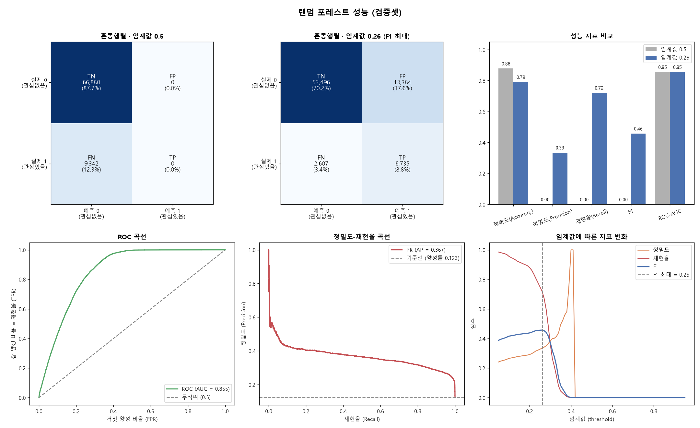
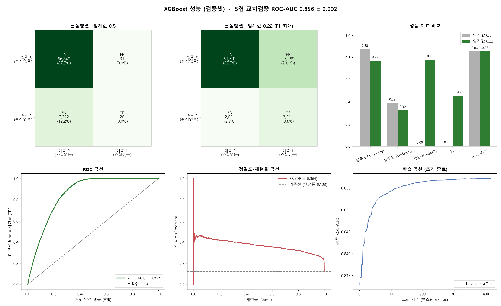
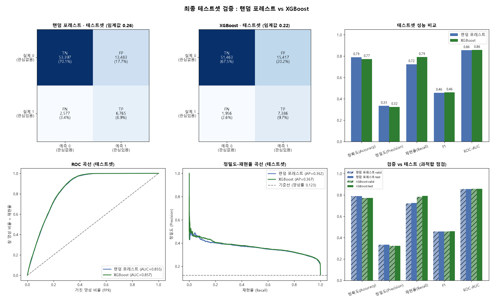
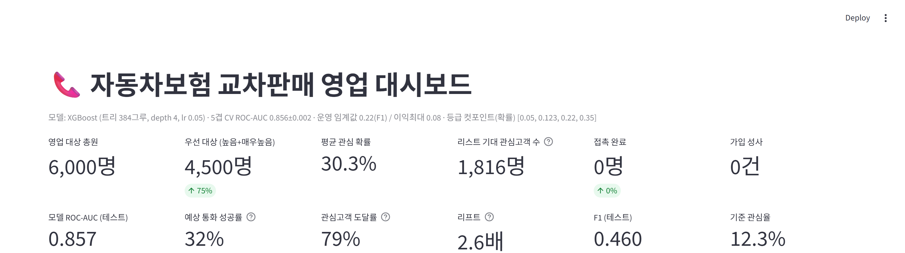
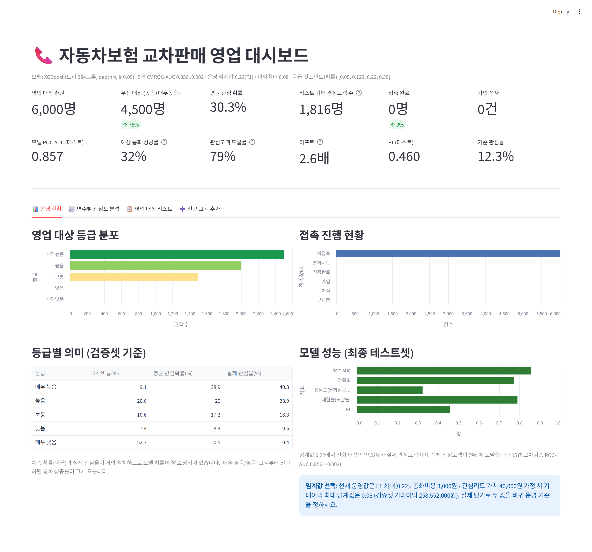
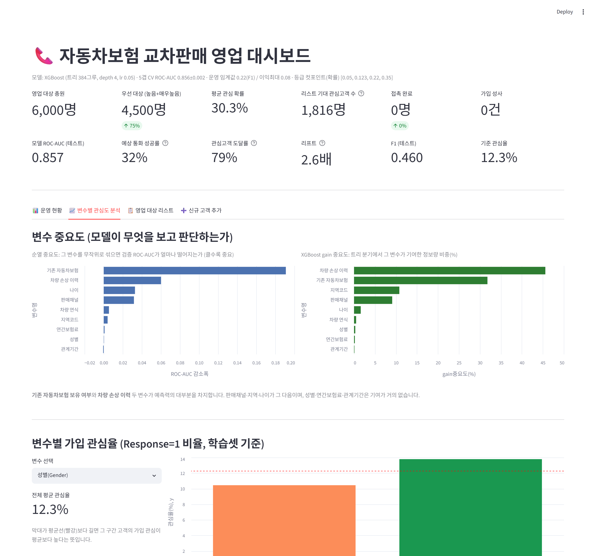
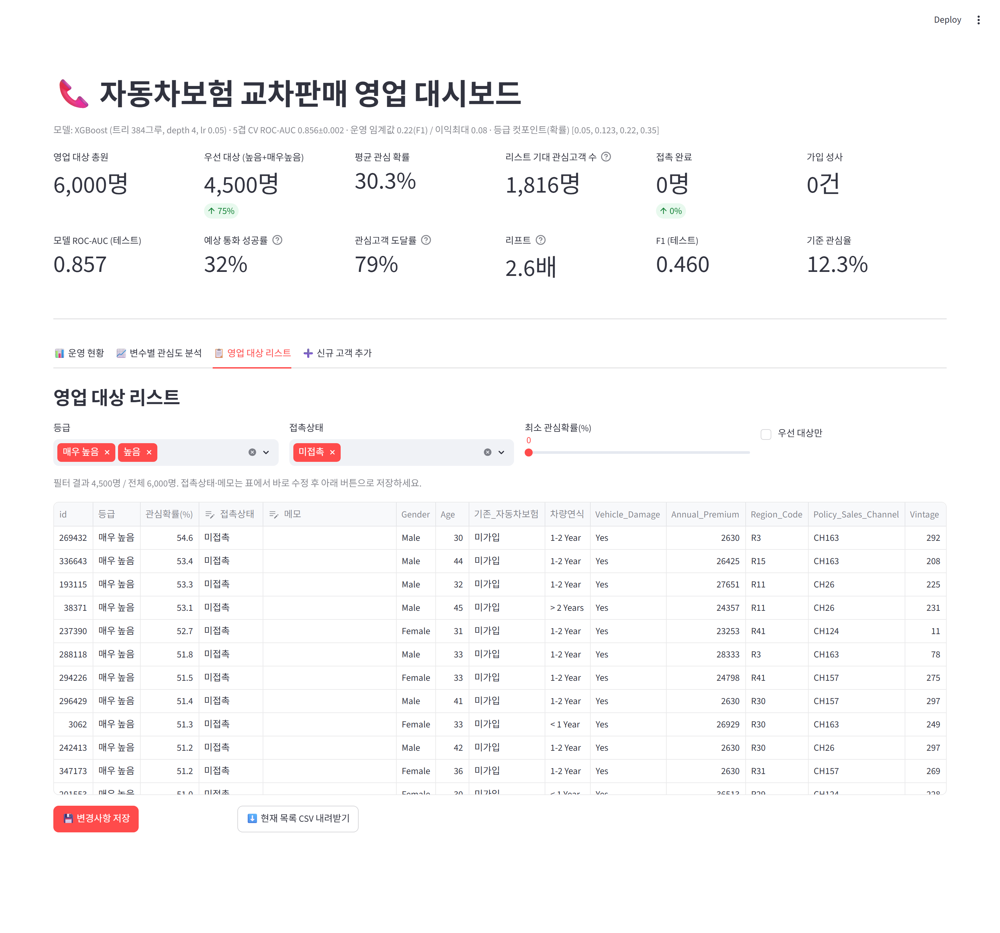
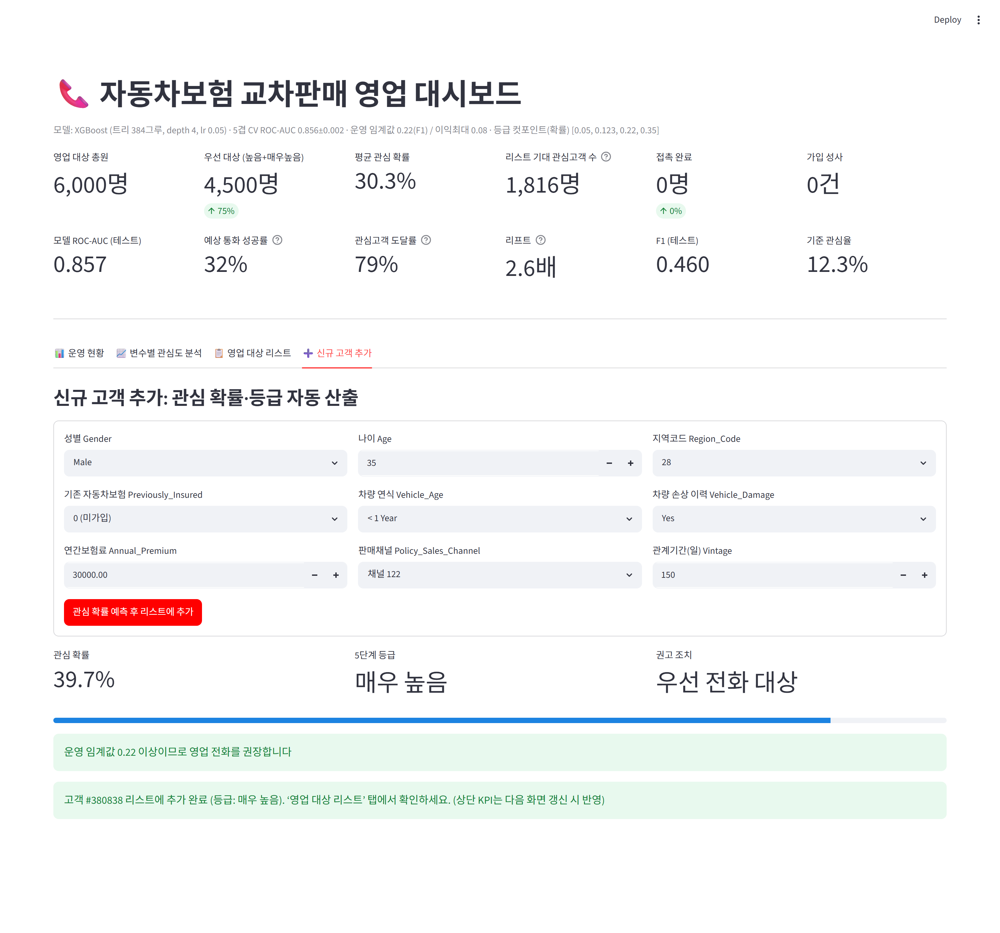

# 자동차보험 교차판매(Cross-sell) 관심 고객 예측 · 영업 운영 대시보드

기존 건강보험 고객에게 **자동차보험 신규 가입 안내 전화를 걸기 직전**, 그 고객이 가입에
관심을 보일 확률을 예측하는 이진 분류 프로젝트입니다. 주 모델은 **XGBoost**이며(랜덤 포레스트와
비교), 예측 결과를 콜센터가 바로 쓸 수 있도록 Streamlit 운영 대시보드로 제공합니다.

- 데이터: 381,109명 × 12열, 관심(Response=1) 비율 12.26% (불균형)
- 모델: XGBoost (depth 4, learning_rate 0.05, 조기 종료로 트리 384그루)
- 성능: 5겹 교차검증 ROC-AUC 0.856 ± 0.002, 최종 테스트 ROC-AUC 0.857
- 운영: 확률 상위 고객부터 전화하면 통화 성공률이 12.3%에서 약 32%로 오름 (리프트 2.6배)

---

## 1. 프로젝트 개요

| 항목 | 내용 |
|------|------|
| 문제 유형 | 이진 분류 (관심 있음 / 없음) |
| 예측 시점 | 자동차보험 안내 전화를 걸기 직전 (기존 고객 정보만 사용) |
| 목표 변수 | `Response` (안내에 관심을 보이면 1) |
| 핵심 활용 | 콜 리스트 우선순위 지정, 통화 효율 개선 |
| 주 모델 | XGBoost (비교군: RandomForest) |

---

## 2. 데이터

원본: `data/raw/insurance_cross_sell.csv` (Kaggle "Health Insurance Cross Sell Prediction" 데이터셋 기반).
원본은 읽기 전용으로만 사용하며 수정하지 않습니다.

### 변수 설명

| 변수 | 의미 | 모델 처리 |
|------|------|-----------|
| `id` | 고객 고유번호 | 입력에서 제외 |
| `Gender` | 성별 (Male/Female) | 원-핫 인코딩 |
| `Age` | 나이 (20-85) | 수치 그대로 |
| `Driving_License` | 운전면허 보유(대부분 1) | **제외** (준상수, 값 1 비율 99.79%) |
| `Region_Code` | 거주 지역 코드 (53종) | 문자 라벨 `R28` 형태로 변환 후 원-핫 |
| `Previously_Insured` | 이미 다른 자동차보험 가입 여부 | 0/1 그대로 |
| `Vehicle_Age` | 차량 연식 구간 | 순서형 인코딩 (`< 1 Year`=0, `1-2 Year`=1, `> 2 Years`=2) |
| `Vehicle_Damage` | 과거 차량 손상 이력 (Yes/No) | 원-핫 인코딩 |
| `Annual_Premium` | 고객이 내는 (건강보험) 연간 보험료 | 수치 그대로 |
| `Policy_Sales_Channel` | 고객 획득 채널 코드 (155종) | 학습셋 빈도 상위 10개만 유지, 나머지는 `CHOTHER` |
| `Vintage` | 회사와의 관계 기간(일, 10-299) | 수치 그대로 |
| `Response` | **목표 변수** (관심 있음=1) | 예측 대상 |

### 변수별 가입 관심율 (학습셋 기준, 전체 평균 12.3%)

| 구간 | 관심율 |
|------|-------:|
| 기존 자동차보험 미가입 | 22.6% |
| 기존 자동차보험 기가입 | 0.1% |
| 차량 손상 이력 Yes | 23.8% |
| 차량 손상 이력 No | 0.5% |
| 차량 연식 2년 초과 | 29.4% |
| 차량 연식 1년 미만 | 4.4% |
| 나이 36-40세 | 21.9% |
| 나이 20-25세 | 3.5% |

`Previously_Insured`, `Vehicle_Damage`, `Vehicle_Age`, `Age`가 관심 여부를 크게 가릅니다.
대시보드 "변수별 관심도 분석" 탭에서 모든 변수를 확인할 수 있습니다.

---

## 3. 디렉터리 구조

```
.
├── data/
│   ├── raw/insurance_cross_sell.csv     원본 (수정 금지)
│   └── processed/                       파이프라인 생성물 (git 제외)
├── analysis/
│   ├── features.py                      원본 -> 모델 입력 변환 공용 함수
│   ├── plotting.py                      matplotlib 한글 폰트 설정
│   ├── split_data.py                    1) 원본을 train/valid/test 로 층화 분할
│   ├── preprocess.py                    2) 전처리 (채널 상위 목록은 train 에서만 산출)
│   ├── build_dashboard_assets.py        3) XGBoost 학습 + 대시보드 자산 생성
│   ├── train_rf.py                      (분석) RandomForest 학습·평가
│   ├── train_xgb.py                     (분석) XGBoost 학습·평가 + 5겹 교차검증
│   ├── evaluate_test.py                 (분석) 최종 테스트셋 검증: RF vs XGB
│   └── run_pipeline.py                  전체 파이프라인 실행기
├── app/dashboard.py                     Streamlit 운영 대시보드
├── outputs/                             그림·표·모델 (git 제외, 스크립트로 재생성)
├── docs/images/                         README 이미지
├── requirements.txt
└── CLAUDE.md                            실습 작업 규칙
```

---

## 4. 실행 방법

```bash
pip install -r requirements.txt

# 전처리 + 대시보드 자산 생성
python analysis/run_pipeline.py

# 분석 스크립트(RF/XGB/테스트평가)까지 모두 실행하려면
python analysis/run_pipeline.py --full

# 대시보드 실행
python -m streamlit run app/dashboard.py
```

`data/processed/`와 `outputs/`의 파일은 모두 스크립트로 재생성되므로 git 에는 원본 데이터만 둡니다.

---

## 5. 파이프라인과 방법론

### 처리 순서

1. **분할 (`split_data.py`)**: 원본을 train 60% / valid 20% / test 20%로 `Response` 층화 분할
   (`random_state=42`). 세 셋 모두 관심율 12.26%로 동일.
2. **전처리 (`preprocess.py`)**: `Driving_License` 제외, `Vehicle_Age` 순서형 인코딩,
   `Region_Code` 문자 라벨화, `Policy_Sales_Channel` 상위 10개 유지.
   상위 채널 목록은 **학습 데이터에서만** 산출하여 검증/테스트에 동일 적용합니다 (누수 방지).
   기준값은 `data/processed/preprocess_params.json`에 저장.
3. **학습 (`build_dashboard_assets.py`, `train_xgb.py`)**: 문자형 범주는 학습셋 기준
   원-핫 인코딩(`OneHotEncoder(handle_unknown="ignore")`), XGBoost는 검증 ROC-AUC가
   30라운드 개선되지 않으면 조기 종료.

### 데이터 누수 방지

- `id`는 입력에서 제외.
- 인코더·채널 상위 목록 등 모든 변환 기준은 학습셋에서만 산출.
- 운영 임계값과 5단계 등급 컷포인트는 검증셋으로 결정. 최종 테스트셋은 모델과 기준을
  모두 확정한 뒤 한 번만 사용.

### 불균형 대응

관심 고객이 12.3%뿐이라 기본 임계값 0.5로는 아무도 "관심 있음"으로 분류되지 않습니다.
`scale_pos_weight`를 적용해도 5겹 CV ROC-AUC가 0.856에서 0.856으로 사실상 변화가 없어,
기본값을 쓰고 **임계값 조정**으로 대응합니다.

| 설정 | CV ROC-AUC |
|------|-----------:|
| scale_pos_weight = 1 | 0.856 ± 0.002 |
| scale_pos_weight = 7.2 | 0.856 ± 0.002 |

### 운영 임계값

- **F1 최대 (0.22)**: 현재 운영값. 정밀도와 재현율의 균형점.
- **기대이익 최대 (0.08)**: 통화비용 3,000원, 관심 리드 가치 40,000원 가정 시 검증셋
  기대이익이 최대가 되는 지점. `analysis/build_dashboard_assets.py` 상단 상수를 실제
  단가로 바꾸면 값이 갱신됩니다.

### 5단계 등급

예측 확률을 영업 행동과 바로 연결되도록 5구간으로 나눕니다. 검증셋에서 각 등급의
**예측 평균 확률과 실제 관심율이 거의 일치**하여(아래 표) 등급을 신뢰하고 사용할 수 있습니다.

| 등급 | 확률 범위 | 고객 비율 | 예측 평균 확률 | 실제 관심율 | 권고 |
|------|-----------|----------:|--------------:|-----------:|------|
| 매우 높음 | 0.35 이상 | 9.1% | 38.9% | 40.3% | 우선 전화 |
| 높음 | 0.22 - 0.35 | 20.6% | 29.0% | 28.9% | 우선 전화 |
| 보통 | 0.123 - 0.22 | 10.6% | 17.2% | 16.3% | 여력 시 전화 |
| 낮음 | 0.05 - 0.123 | 7.4% | 8.9% | 9.5% | 전화 비권장 |
| 매우 낮음 | 0.05 미만 | 52.3% | 0.5% | 0.4% | 제외 |

---

## 6. 분석 결과

### 6.1 RandomForest (비교군)

`n_estimators=150, max_depth=12, min_samples_split=20`



### 6.2 XGBoost (주 모델)

`n_estimators=1000(최대), max_depth=4, learning_rate=0.05`, 조기 종료로 384그루 사용.
5겹 교차검증 ROC-AUC 0.856 ± 0.002.



두 모델 모두 기본 임계값 0.5에서는 정밀도·재현율·F1이 0에 가깝습니다. 판별력(ROC-AUC)은
충분하지만, 소수 클래스 특성상 확률이 0.5를 넘는 고객이 거의 없기 때문입니다.
임계값을 낮추면 재현율이 크게 오릅니다.

### 6.3 최종 테스트셋 검증: RF vs XGBoost

운영 임계값은 검증셋에서 결정한 값(RF 0.26, XGB 0.22)을 그대로 테스트셋에 적용했습니다.



| 모델 | 구분 | ROC-AUC | 정확도 | 정밀도 | 재현율 | F1 |
|------|------|--------:|------:|------:|------:|---:|
| RandomForest | valid | 0.855 | 0.790 | 0.335 | 0.721 | 0.457 |
| RandomForest | test | 0.855 | 0.789 | 0.334 | 0.724 | 0.457 |
| XGBoost | valid | 0.857 | 0.773 | 0.323 | 0.783 | 0.458 |
| XGBoost | test | 0.857 | 0.772 | 0.324 | 0.791 | 0.460 |

- 검증셋과 테스트셋 성능이 거의 일치 (차이 0.001 수준) → 과적합 없음.
- 두 모델의 판별력은 사실상 동률. XGBoost가 근소하게 앞서고, 384그루 × depth 4로 더 가볍고 빠릅니다.
- **XGBoost 채택.** 임계값 0.22에서 전화 대상의 약 32%가 실제 관심 고객이며(무작위 12.3%),
  전체 관심 고객의 79%에 도달합니다.

### 6.4 변수 중요도

| 변수 | 순열 중요도 (ROC-AUC 감소) | XGB gain (%) |
|------|--------------------------:|-------------:|
| 기존 자동차보험 | 0.191 | 31.8 |
| 차량 손상 이력 | 0.060 | 45.6 |
| 나이 | 0.033 | 1.6 |
| 판매채널 | 0.032 | 9.1 |
| 차량 연식 | 0.006 | 0.5 |
| 지역코드 | 0.004 | 10.8 |
| 연간보험료 | 0.001 | 0.2 |
| 성별 | 0.000 | 0.3 |
| 관계기간 | -0.001 | 0.1 |

`Previously_Insured`와 `Vehicle_Damage`가 예측력의 대부분을 차지합니다. 성별·연간보험료·관계기간은
기여가 거의 없습니다.

---

## 7. 운영 대시보드

`python -m streamlit run app/dashboard.py`

### 상단 KPI



영업 대상 총원, 우선 대상 수, 평균 관심 확률, 리스트 기대 관심고객 수, 접촉 완료·가입 성사,
모델 ROC-AUC, 예상 통화 성공률, 관심고객 도달률, 리프트 등을 한눈에 봅니다.

### 탭 1 · 운영 현황



영업 대상의 등급 분포, 등급별 의미(검증셋 기준 예측 확률 대 실제 관심율), 접촉 진행 현황,
최종 테스트셋 모델 성능, 임계값 선택 안내를 제공합니다.

### 탭 2 · 변수별 관심도 분석



변수 중요도(순열 중요도, XGB gain)와 변수별 가입 관심율을 보여줍니다. 변수를 선택하면 구간별
관심율 막대가 전체 평균선과 함께 표시됩니다.

### 탭 3 · 영업 대상 리스트



등급·접촉상태·최소 관심확률로 필터링하고, 표에서 접촉상태(미접촉/통화시도/접촉완료/가입/거절/부재중)와
메모를 직접 수정한 뒤 저장합니다. 현재 목록을 CSV로 내려받을 수 있습니다.

### 탭 4 · 신규 고객 추가



고객 정보를 입력하면 XGBoost가 **관심 확률(%)과 5단계 등급, 권고 조치**를 즉시 산출하고
영업 대상 리스트에 추가합니다.

> 영업 대상 리스트 시드는 테스트 분할(학습·임계값 선정에 쓰이지 않은 홀드아웃)에서 뽑은
> 6,000명입니다. 데모에서 등급 분포가 보이도록 매우높음/높음/보통을 섞어 표본 추출했습니다.

---

## 8. 한계와 향후 개선

- **모델 성능 상한**: ROC-AUC 0.857은 쓸만하지만 완벽과는 거리가 있습니다. 임계값 0.22에서
  전화 대상의 약 2/3는 여전히 관심이 없습니다.
- **하이퍼파라미터**: depth·learning_rate 등은 실습 지정값이며 별도 튜닝(그리드/베이지안 탐색)은
  하지 않았습니다.
- **파생 변수 부재**: 나이대 × 차량손상 등 상호작용 변수를 추가하면 개선 여지가 있습니다.
- **비용 가정**: 기대이익 임계값의 통화비용·리드 가치는 예시값이며 실제 단가로 교체해야 합니다.
- **시간 정보 없음**: 가입일 등 타임스탬프가 없어 시간 기반 검증은 적용하지 않았습니다.

---

## 9. 데이터 출처

Kaggle "Health Insurance Cross Sell Prediction" 데이터셋을 학습·연습 목적으로 사용했습니다.
개인정보나 실제 고객 데이터는 포함되어 있지 않습니다.
